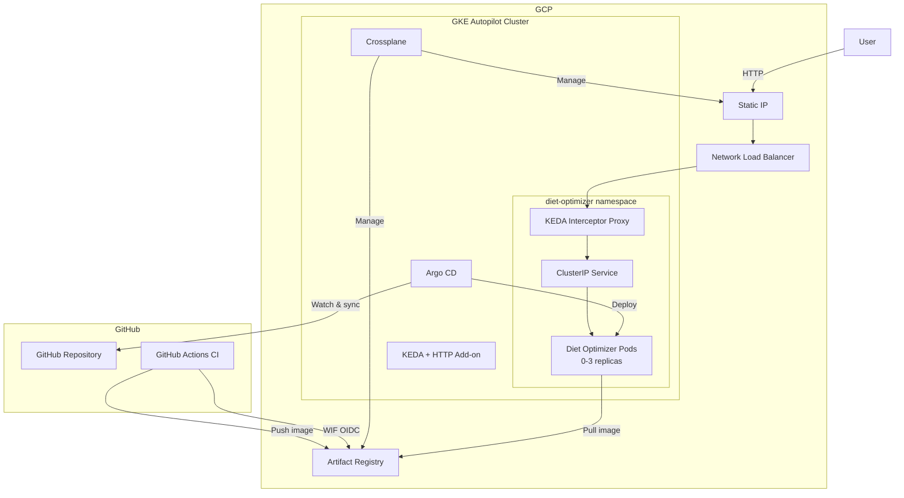
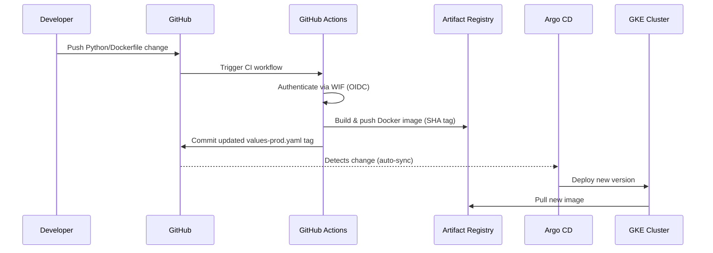
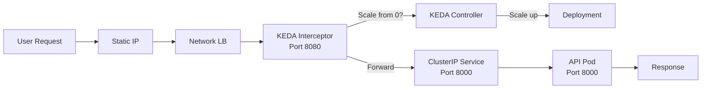
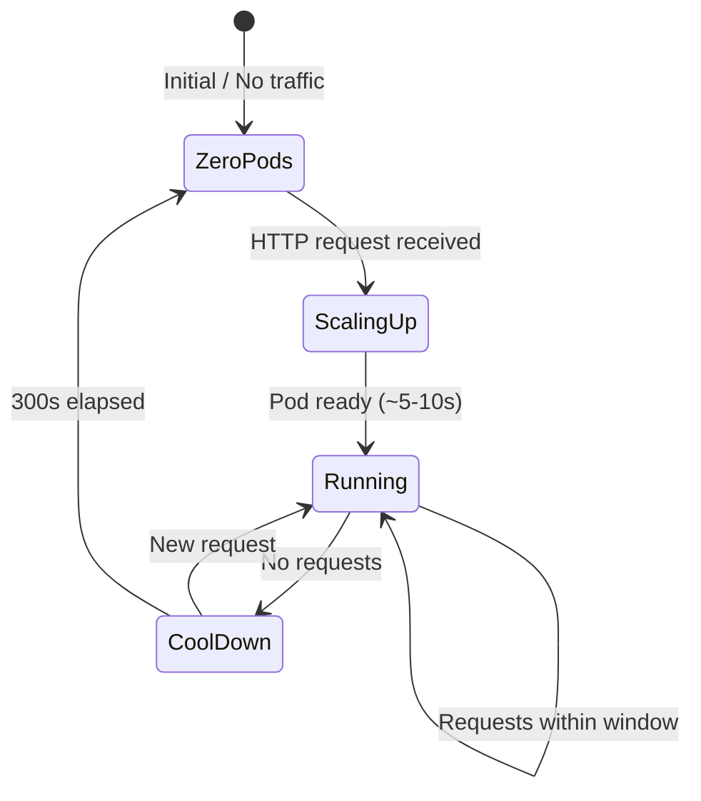

# Diet Optimizer - GKE Autopilot Deployment

## Architecture Overview

The Diet Optimizer API runs on GKE Autopilot with true scale-to-zero using KEDA, deployed via GitOps with Argo CD. Zero stored credentials — all authentication uses Workload Identity.

### Architecture Components



### CI/CD Flow



### HTTP Request Flow



### Scale-to-Zero State Machine



## Cost Breakdown

| Resource | Cost | Notes |
|----------|------|-------|
| GKE Autopilot cluster fee | ~$6.85/mo | Flat management fee |
| Compute (scale-to-zero, ~4hr/day active) | ~$2-5/mo | 0.5 vCPU + 512MB only when pods run |
| Always-on components (KEDA, Argo CD) | Included | ~0.5 vCPU + 512MB total |
| Static IP | ~$0-1.46/mo | Free when in use, ~$1.46 when idle |
| Artifact Registry storage | ~$0.10/mo | Docker images |
| Network egress | ~$0.01-1/mo | STANDARD tier, minimal traffic |
| **Total** | **~$10-14/mo** | |

## Prerequisites

### CLI Tools

- [Terraform](https://developer.hashicorp.com/terraform/install) >= 1.5
- [Helm](https://helm.sh/docs/intro/install/) >= 3.12
- [kubectl](https://kubernetes.io/docs/tasks/tools/)
- [gcloud CLI](https://cloud.google.com/sdk/docs/install)
- `envsubst` (part of GNU gettext)

### GCP Setup

1. Create a GCP project
2. Enable billing
3. Install and authenticate gcloud: `gcloud auth application-default login`

## Setup Instructions

### 1. Configure Terraform

```bash
cd terraform
cp terraform.tfvars.example terraform.tfvars
# Edit terraform.tfvars with your GCP project ID and GitHub info
```

### 2. Deploy Infrastructure

```bash
terraform init
terraform plan
terraform apply
```

This creates:
- GKE Autopilot cluster
- IAM service accounts + Workload Identity bindings
- Installs Crossplane, KEDA, and Argo CD via Helm

### 3. Configure kubectl

```bash
gcloud container clusters get-credentials $(terraform output -raw cluster_name) \
  --region $(terraform output -raw cluster_location) \
  --project YOUR_PROJECT_ID
```

### 4. Apply Crossplane Resources

```bash
export GCP_PROJECT_ID=your-project-id
export GCP_REGION=us-central1

envsubst < ../crossplane/provider-config.yaml | kubectl apply -f -
envsubst < ../crossplane/static-ip.yaml | kubectl apply -f -
envsubst < ../crossplane/artifact-registry.yaml | kubectl apply -f -
```

### 5. Wait for Crossplane Provisioning

```bash
kubectl get address.compute.gcp.upbound.io/diet-optimizer-ip -w
kubectl get repository.artifactregistry.gcp.upbound.io/diet-optimizer-repo -w
```

### 6. Update Production Values

Update `helm/diet-optimizer/values-prod.yaml` with:
- `image.repository`: The Artifact Registry URL from Crossplane
- `loadBalancer.staticIP`: The static IP from Crossplane

### 7. Push Initial Docker Image

```bash
REGISTRY_URL=<region>-docker.pkg.dev/<project>/<repo>
docker build -t $REGISTRY_URL/diet-optimizer:latest .
docker push $REGISTRY_URL/diet-optimizer:latest
```

### 8. Deploy Argo CD Application

```bash
kubectl apply -f argocd/application.yaml
```

### 9. Configure GitHub Secrets

Add these to your GitHub repository settings (Settings > Secrets > Actions):

| Secret | Value | Source |
|--------|-------|--------|
| `WIF_PROVIDER_ID` | Workload Identity Federation provider ID | `terraform output wif_provider_id` |
| `GH_ACTIONS_SA_EMAIL` | GitHub Actions SA email | `terraform output github_actions_sa_email` |
| `GCP_REGION` | GCP region (e.g., `us-central1`) | Your terraform.tfvars |
| `REGISTRY_URL` | Artifact Registry URL | `<region>-docker.pkg.dev/<project>/diet-optimizer-repo` |

## Secrets Management

This deployment uses **zero stored credential files**:

- **GitHub Actions to GCP**: Workload Identity Federation (WIF) — GitHub's OIDC token is exchanged for a short-lived GCP access token. No JSON key files.
- **Crossplane to GCP**: GKE Workload Identity — the Crossplane pod's K8s Service Account is bound to a GCP Service Account. No JSON key files.
- **GitHub Secrets**: Only contain non-sensitive identifiers (WIF provider ID, SA email, region, registry URL). These are infrastructure metadata, not credentials.

## Verification

```bash
# Check all components are running
kubectl get pods -n keda
kubectl get pods -n argocd
kubectl get pods -n crossplane-system

# Check static IP provisioned
kubectl get address.compute.gcp.upbound.io/diet-optimizer-ip

# Test health endpoint
curl http://<STATIC_IP>/health

# Test optimization endpoint
curl -X POST http://<STATIC_IP>/optimize \
  -H 'Content-Type: application/json' \
  -d @example_request.json

# Test scale-to-zero (wait 5+ minutes with no traffic)
kubectl get pods -n diet-optimizer  # Should show 0 pods

# Send a request - pod should scale up within 5-10s
curl http://<STATIC_IP>/health
```

## Troubleshooting

### Pods not scaling up
- Check KEDA HTTP Add-on interceptor: `kubectl get pods -n keda`
- Check HTTPScaledObject: `kubectl get httpscaledobject -n diet-optimizer`
- Check interceptor logs: `kubectl logs -n keda -l app=keda-add-ons-http-interceptor-proxy`

### Crossplane resources stuck
- Check Crossplane pod: `kubectl get pods -n crossplane-system`
- Check provider status: `kubectl get providers`
- Check managed resource events: `kubectl describe address.compute.gcp.upbound.io/diet-optimizer-ip`

### Argo CD sync issues
- Check Argo CD application: `kubectl get applications -n argocd`
- View sync status: `kubectl describe application diet-optimizer -n argocd`
- Access Argo CD UI: `kubectl port-forward svc/argocd-server -n argocd 8080:443`

### Image pull errors
- Verify Artifact Registry exists: `gcloud artifacts repositories list`
- Check image exists: `gcloud artifacts docker images list <REGISTRY_URL>`
- Verify Workload Identity binding for image pull

## References

- [GKE Autopilot](https://cloud.google.com/kubernetes-engine/docs/concepts/autopilot-overview)
- [KEDA HTTP Add-on](https://github.com/kedacore/http-add-on)
- [Crossplane GCP Provider](https://marketplace.upbound.io/providers/upbound/provider-gcp/)
- [Argo CD](https://argo-cd.readthedocs.io/en/stable/)
- [Helm](https://helm.sh/docs/)
- [Workload Identity](https://cloud.google.com/kubernetes-engine/docs/how-to/workload-identity)
- [Workload Identity Federation](https://cloud.google.com/iam/docs/workload-identity-federation)
- [Terraform GCP Provider](https://registry.terraform.io/providers/hashicorp/google/latest/docs)
